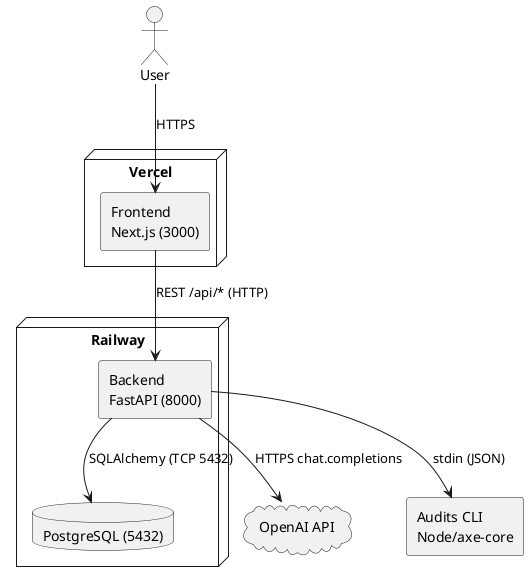
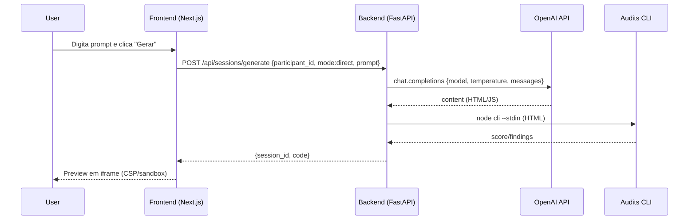
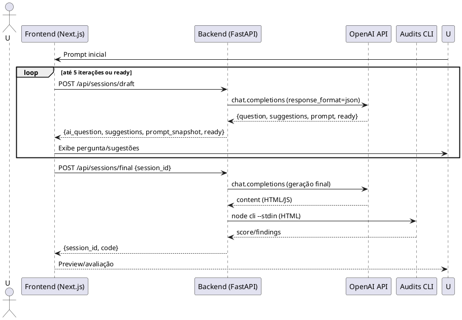

## Sumário executivo

- Monorepo com três módulos: frontend (Next.js 16 + Tailwind 4, TypeScript), backend (FastAPI + SQLAlchemy + PostgreSQL) e serviço de auditorias (Node/TS com axe-core), orquestrados via Docker Compose. Evidências: `interfacegen/frontend/package.json:12-15,21-23`; `interfacegen/backend/requirements.txt:1-5`; `interfacegen/audits/package.json:6-16`; `interfacegen/docker-compose.yml:3-13,15-27`.
- Frontend usa App Router (pasta `app/`) e consome o backend via REST com `fetch`, base configurável por `NEXT_PUBLIC_API_BASE_URL` (padrão `http://localhost:8000/api`). Evidências: `interfacegen/frontend/app/page.tsx:7`; `interfacegen/frontend/lib/api.ts:76-88,101-134`.
- Backend expõe rotas REST (sessions, runs, feedback, export) com CORS configurável; integra OpenAI por `httpx` com retry/backoff (`tenacity`) e tratamento de 429/5xx. Evidências: `interfacegen/backend/app/main.py:15-22,25-35`; `interfacegen/backend/app/services/llm_client.py:18-23,61-74`.
- Parâmetros do modelo: `LLM_MODEL` (default "gpt-4o") e `LLM_TEMPERATURE` (default 0.7). O uso exclusivo de “gpt-4o-mini” depende do `.env` (possível/indeterminado). Evidências: `interfacegen/backend/app/config.py:17-19`; `interfacegen/backend/app/routers/sessions.py:202-206,267-269`.
- Dados no PostgreSQL com SQLAlchemy; tabelas `participants`, `sessions`, `draft_turns`, `feedbacks`; criação/migrações simples no startup. Evidências: `interfacegen/backend/app/db/models.py:9-17,19-38,40-55,57-73`; `interfacegen/backend/app/main.py:42-62`.
- Auditorias automáticas de acessibilidade via CLI Node que roda axe-core (score 0–100) e retorna achados WCAG; chamadas pelo backend via `subprocess`. Evidências: `interfacegen/audits/src/cli.ts:11-23,34-44,64-67`; `interfacegen/backend/app/services/audits_runner.py:7-26`.
- Segurança: CORS, cap de 200k chars no HTML retornado, preview em `iframe` com CSP restritiva e `sandbox`. Evidências: `interfacegen/backend/app/main.py:15-22`; `interfacegen/backend/app/routers/sessions.py:41-43`; `interfacegen/frontend/components/CodePreview.tsx:11-25`.
- Deploy Vercel/Railway: não há `vercel.json`/`railway.json` no repo; execução local por Docker está documentada. Declaração de Vercel/Railway é (possível/indeterminado). Evidências: `interfacegen/docs/guia_execucao.md:29-41,56-66`.

### 0) Metadados do Repositório

- `/interfacegen/` — Raiz do monorepo, contém `frontend/`, `backend/`, `audits/`, `docs/`, `docker-compose.yml`. (Estrutura listada em workspace)
- `/interfacegen/docker-compose.yml` — Orquestração de `db` (Postgres 16), `backend` (8000), build de `audits`. `interfacegen/docker-compose.yml:3-13,15-27`.
- `/interfacegen/frontend/` — App Next.js (16.0.1) + Tailwind 4 + TS; App Router em `app/`. `interfacegen/frontend/package.json:12-15,21-23`.
- `/interfacegen/backend/` — FastAPI + SQLAlchemy + psycopg2; routers/schemas/services. `interfacegen/backend/requirements.txt:1-5`; `interfacegen/backend/app/main.py:11-22`.
- `/interfacegen/audits/` — Node/TS, axe-core e lighthouse; CLI próprio. `interfacegen/audits/package.json:6-16`; `interfacegen/audits/src/cli.ts:46-67`.
- Workspaces/apps/packages — Módulos independentes (sem pnpm/yarn workspaces).
- Gerenciadores/lockfiles — npm com `package-lock.json` no frontend; Python `requirements.txt` no backend; `audits` sem lockfile (Docker tenta `npm ci` e cai para `npm install`). `interfacegen/frontend/package-lock.json`; `interfacegen/backend/requirements.txt:1-12`; `interfacegen/audits/Dockerfile:3-6`.

## Seção “Arquitetura e Tecnologias Utilizadas”

Texto

- O frontend usa Next.js 16 (App Router) com Tailwind 4 e TypeScript, e comunica-se com o backend via REST (`fetch`) a partir de `lib/api.ts` com base configurável por `NEXT_PUBLIC_API_BASE_URL`. `interfacegen/frontend/package.json:12-15,21-23`; `interfacegen/frontend/lib/api.ts:76-88,101-134`.
- O backend usa FastAPI com routers modulares para sessões, runs, feedback e export; CORS configurável por env; integra com a OpenAI API via `httpx` e `tenacity` (retry/backoff e tratamento de 429/5xx). `interfacegen/backend/app/main.py:15-22,25-35`; `interfacegen/backend/app/services/llm_client.py:18-23,61-74`.
- Persistência em PostgreSQL com SQLAlchemy; modelos `Participant`, `Session`, `DraftTurn`, `Feedback` e criação do schema no startup. `interfacegen/backend/app/db/models.py:9-17,19-38,40-55,57-73`; `interfacegen/backend/app/main.py:42-62`.
- Auditorias: backend invoca CLI Node do módulo `audits` que executa axe-core via JSDOM, computando score 0–100 e achados WCAG. `interfacegen/audits/src/cli.ts:34-44,64-67`; `interfacegen/backend/app/services/audits_runner.py:7-26`.
- Infra local por Docker Compose (db, backend e build de audits). Frontend roda local (3000) ou pode apontar para backend remoto via env. `interfacegen/docker-compose.yml:3-13,15-27`; `interfacegen/frontend/lib/api.ts:76-83`.

Tabela — Tecnologias

| Tecnologia     | Versão    | Papel no Sistema      | Justificativa curta         | Arquivos-chave                                                           |
| -------------- | --------- | --------------------- | --------------------------- | ------------------------------------------------------------------------ |
| Next.js        | 16.0.1    | Frontend (App Router) | Estrutura moderna em `app/` | `frontend/package.json:12-15`, `frontend/app/page.tsx:7`                 |
| React          | 19.2.0    | UI                    | Componentização e hooks     | `frontend/package.json:12-15`                                            |
| Tailwind CSS   | ^4        | Estilos               | Produtividade/consistência  | `frontend/package.json:21-23`, `frontend/app/globals.css:1`              |
| FastAPI        | 0.115.0   | API backend           | Tipagem/desempenho          | `backend/requirements.txt:1`, `backend/app/main.py:11`                   |
| Uvicorn        | 0.30.6    | ASGI server           | Execução FastAPI            | `backend/requirements.txt:2`, `backend/Dockerfile:19`                    |
| SQLAlchemy     | 2.0.35    | ORM                   | Modelagem/DB                | `backend/requirements.txt:3`, `backend/app/db/models.py:19-38`           |
| PostgreSQL     | 16-alpine | Banco de dados        | Relacional robusto          | `docker-compose.yml:5`                                                   |
| httpx          | 0.27.2    | HTTP OpenAI           | Timeout/erros               | `backend/requirements.txt:7`, `backend/app/services/llm_client.py:60-66` |
| tenacity       | 9.0.0     | Retry/backoff         | Resiliência a 429/5xx       | `backend/requirements.txt:8`, `backend/app/services/llm_client.py:18-23` |
| axe-core       | 4.9.1     | A11y audit            | Score + violações           | `audits/package.json:9-13`, `audits/src/cli.ts:34-44`                    |
| Docker Compose | 3.9       | Orquestração          | Subir db/backend/audits     | `docker-compose.yml:1-7,15-27`                                           |

Diagrama de Arquitetura (Mermaid)

```mermaid
flowchart LR
  User[User]
  FE[Frontend (Next.js — Vercel)<br/>Port 3000]
  BE[Backend (FastAPI — Railway)<br/>Port 8000]
  DB[(PostgreSQL — Railway)<br/>Port 5432]
  OA[OpenAI API (HTTPS)]
  AU[Audits CLI (Node/axe-core)]

  User -->|HTTPS| FE
  FE -->|REST /api/*| BE
  BE -->|SQLAlchemy| DB
  BE -->|HTTPS chat.completions| OA
  BE -->|stdin JSON| AU
```

Arquitetura (PlantUML — alternativo)



## Seção “Fluxo de Funcionamento do InterfaceGen”

Texto

- (A) Prompt Direto: `PromptInput` valida `participant_id` e `prompt` e chama `POST /sessions/generate`; backend monta prompt direto, chama LLM, limita a 200k chars, persiste sessão, executa auditoria e retorna `{session_id, code}`; frontend redireciona para preview em `iframe` com CSP/sandbox. `frontend/components/PromptInput.tsx:12-31,37-51`; `frontend/lib/api.ts:105-109`; `backend/app/routers/sessions.py:19-43,60-69`; `frontend/components/CodePreview.tsx:11-25`.
- (B) Wizard Guiado: UI inicia com prompt inicial e até 5 iterações; cada iteração chama `POST /sessions/draft` com `turn_index`, `current_prompt`, `user_answer`; backend gera `messages` (PE4RE/self-critique), chama `chat` com `response_format` JSON, faz parsing robusto, atualiza `prompt_snapshot` e avalia `ready` (≥3 iterações ou sinal da LLM); ao final, `POST /sessions/final` gera o código e executa auditoria, redirecionando para preview/avaliação. `frontend/app/wizard/page.tsx:16,68-87,101-110,120-139,151-170`; `backend/app/services/prompt_builder.py:19-37`; `backend/app/routers/sessions.py:102-121,201-206,252-270,273-308`.

Tabela — Etapas do fluxo

| Etapa            | Componente | Arquivo:linha                                     | Entrada                    | Saída                     | Observações        |
| ---------------- | ---------- | ------------------------------------------------- | -------------------------- | ------------------------- | ------------------ |
| UI Direto        | Frontend   | `frontend/app/direct/page.tsx:15-18`              | Texto                      | onClick gerar             | Usa `PromptInput`  |
| Validação/Envio  | Frontend   | `frontend/components/PromptInput.tsx:12-31`       | prompt, participant_id     | POST `/sessions/generate` | Loading/erros      |
| Geração (direct) | Backend    | `backend/app/routers/sessions.py:29-43`           | prompt                     | code                      | Cap 200k chars     |
| Auditoria        | Backend    | `backend/app/services/audits_runner.py:12-23`     | HTML                       | score/findings            | axe-core via CLI   |
| Preview          | Frontend   | `frontend/components/CodePreview.tsx:11-25`       | code                       | iframe                    | CSP + sandbox      |
| UI Wizard        | Frontend   | `frontend/app/wizard/page.tsx:151-170`            | prompt inicial             | iniciar loop              | MAX_TURNS=5        |
| Draft turn       | Frontend   | `frontend/app/wizard/page.tsx:68-80`              | turn_index, prompt, answer | POST `/sessions/draft`    | Atualiza snapshot  |
| Refinamento      | Backend    | `backend/app/routers/sessions.py:104-117,201-206` | messages, temp=0.7         | JSON (q,prompt,ready)     | Parser tolerante   |
| Heurística ready | Backend    | `backend/app/routers/sessions.py:252-259,267-270` | iterações                  | ready flag                | ≥3 iterações       |
| Finalização      | Frontend   | `frontend/app/wizard/page.tsx:120-139`            | session_id                 | POST `/sessions/final`    | Redireciona        |
| Geração (final)  | Backend    | `backend/app/routers/sessions.py:285-308`         | final_prompt               | code                      | Auditoria idem     |
| Export/Admin     | Frontend   | `frontend/app/admin/page.tsx:46-63,66-75`         | links export               | JSON/CSV                  | Painel pesquisador |

Diagramas de sequência (Mermaid)

(A) Prompt Direto



(B) Wizard Guiado

```mermaid
sequenceDiagram
  participant U as User
  participant FE as Frontend (Next.js)
  participant BE as Backend (FastAPI)
  participant OA as OpenAI API
  participant AU as Audits CLI

  U->>FE: Prompt inicial
  loop até 5 iterações ou ready
    FE->>BE: POST /api/sessions/draft {turn_index, current_prompt, user_answer}
    BE->>OA: chat.completions (response_format json)
    OA-->>BE: {"question","suggestions","prompt","ready"}
    BE-->>FE: {ai_question, suggestions, prompt_snapshot, ready}
    FE->>U: Mostra pergunta/sugestões; coleta resposta
  end
  FE->>BE: POST /api/sessions/final {session_id}
  BE->>OA: chat.completions (geração final)
  OA-->>BE: content (HTML/JS)
  BE->>AU: node cli --stdin (HTML)
  AU-->>BE: score/findings
  BE-->>FE: {session_id, code}
  FE-->>U: Preview/avaliação
```

Wizard Guiado (PlantUML — alternativo)



## Anexos

Lista de arquivos citados (arquivo:linhas)

- `interfacegen/docker-compose.yml:3-13,15-27`
- `interfacegen/backend/app/main.py:11-22,25-35,42-62`
- `interfacegen/backend/app/config.py:15-21`
- `interfacegen/backend/app/db/session.py:8-12`
- `interfacegen/backend/app/db/models.py:9-17,19-38,40-55,57-73`
- `interfacegen/backend/app/routers/sessions.py:19-69,102-121,201-206,252-270,273-308,312-327`
- `interfacegen/backend/app/routers/runs.py:14-33,51-89`
- `interfacegen/backend/app/routers/feedback.py:12-51`
- `interfacegen/backend/app/routers/export.py:13-39,42-90`
- `interfacegen/backend/app/schemas/session.py:8-19,21-39,42-45`
- `interfacegen/backend/app/services/llm_client.py:18-23,41-56,60-74,83-121,126-132`
- `interfacegen/backend/app/services/prompt_builder.py:5-16,19-48`
- `interfacegen/backend/app/services/audits_runner.py:7-26`
- `interfacegen/backend/requirements.txt:1-12`
- `interfacegen/backend/Dockerfile:17-19`
- `interfacegen/audits/package.json:6-16`
- `interfacegen/audits/src/cli.ts:11-23,25-44,46-67`
- `interfacegen/audits/Dockerfile:1-7`
- `interfacegen/frontend/package.json:12-15,21-25`
- `interfacegen/frontend/next.config.ts:3-7`
- `interfacegen/frontend/app/globals.css:1-2,15-20,22-26`
- `interfacegen/frontend/lib/api.ts:76-88,101-134`
- `interfacegen/frontend/components/CodePreview.tsx:11-25`
- `interfacegen/frontend/components/PromptInput.tsx:12-31`
- `interfacegen/frontend/components/WizardForm.tsx:37-56`
- `interfacegen/frontend/app/page.tsx:31-40,70-77`
- `interfacegen/frontend/app/direct/page.tsx:15-18`
- `interfacegen/frontend/app/wizard/page.tsx:16,68-87,101-110,120-139,151-170,174-185,196-214,231-243,247-267,271-291,294-301`
- `interfacegen/frontend/app/results/page.tsx:58-76,98-106,141-147,158-169`
- `interfacegen/frontend/app/admin/page.tsx:46-63,66-75,96-106,131-143`

Snippets (≤20 linhas) com relevância

1. Retry/backoff + tratamento 429 (resiliência OpenAI)

```18:23:/Users/Guga/Desktop/tcc-genai-codificacao/interfacegen/backend/app/services/llm_client.py
@retry(
  stop=stop_after_attempt(3),
  wait=wait_exponential(multiplier=0.5, min=1, max=8),
  retry=retry_if_exception_type(httpx.HTTPError),
  retry_error_callback=_fallback_html,
)
```

```67:74:/Users/Guga/Desktop/tcc-genai-codificacao/interfacegen/backend/app/services/llm_client.py
if status in {429, 500, 502, 503, 504}:
    raise
# Demais 4xx: não há sentido em re-tentar; deixa cair para fallback via callback
return _fallback_html(None)
```

2. Cap de tamanho do HTML gerado (segurança/performance)

```41:43:/Users/Guga/Desktop/tcc-genai-codificacao/interfacegen/backend/app/routers/sessions.py
if len(code) > 200_000:
    code = code[:200_000]
```

3. CSP e sandbox no preview (isolamento de execução)

```11:17:/Users/Guga/Desktop/tcc-genai-codificacao/interfacegen/frontend/components/CodePreview.tsx
<meta http-equiv="Content-Security-Policy" content="default-src 'none'; img-src data:; style-src 'unsafe-inline'; script-src 'unsafe-inline'">
...
<iframe sandbox="allow-scripts" ... />
```

4. Auditoria de acessibilidade (axe-core via CLI)

```34:43:/Users/Guga/Desktop/tcc-genai-codificacao/interfacegen/audits/src/cli.ts
const results = await axe.run(document)
const violations = results.violations.map((v: any) => ({
  id: v.id,
  impact: v.impact,
  description: v.description,
  nodes: v.nodes?.length || 0
}))
const score = computeScore(violations)
```

5. Base de API configurável (frontend)

```76:83:/Users/Guga/Desktop/tcc-genai-codificacao/interfacegen/frontend/lib/api.ts
const API_BASE =
  process.env.NEXT_PUBLIC_API_BASE_URL?.replace(/\/$/, "") ||
  "http://localhost:8000/api";
```

6. DB URL padrão e variáveis de ambiente (backend)

```15:21:/Users/Guga/Desktop/tcc-genai-codificacao/interfacegen/backend/app/config.py
self.database_url = os.getenv("DATABASE_URL", "postgresql+psycopg2://interfacegen:interfacegen@db:5432/interfacegen")
self.openai_api_key = os.getenv("OPENAI_API_KEY")
self.llm_model = os.getenv("LLM_MODEL", "gpt-4o")
self.llm_temperature = float(os.getenv("LLM_TEMPERATURE", "0.7"))
self.audits_cli_path = os.getenv("AUDITS_CLI_PATH", "/audits/dist/cli.js")
```
